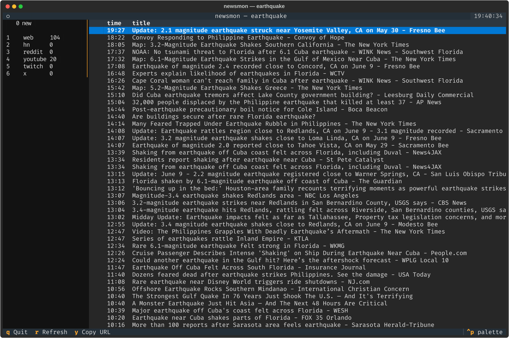

# newsmon

A terminal UI that monitors the public web, YouTube, Twitch, X/Twitter, and
other sources for **breaking news** matching a topic you give on the command
line. It uses only publicly available endpoints — **no API keys, no
registration**. Sources that can't be reached cleanly without keys are included
on a best-effort basis and clearly marked as unreliable in the UI.

Built with Python and [Textual](https://textual.textualize.io/).

```
.venv/bin/python -m newsmon "earthquake" --hours 24 --bell
```



## Install

Requires Python ≥ 3.12.

```bash
python3 -m venv .venv
.venv/bin/pip install -e .          # add ".[dev]" for the test tooling
```

This installs the `newsmon` console script. You can run it either way:

```bash
newsmon "topic keywords"
# or
python -m newsmon "topic keywords"
```

## Usage

```
newsmon "topic keywords" [--hours 6] [--interval 60] [--bell] \
        [--sources web,hn,reddit,youtube,twitch,x,bing,gdelt,masto]
```

| Flag | Default | Meaning |
|------|---------|---------|
| `topic` (positional) | — | Search keywords; quote if multi-word |
| `--hours` | `6` | Recency window — items older than this are dropped |
| `--interval` | `60` | Poll cadence, in seconds |
| `--bell` | off | Ring the terminal bell when a new item arrives live |
| `--sources` | all | Comma list to enable a subset of sources |

### Keys

| Key | Action |
|-----|--------|
| `1`–`9` | Toggle the Nth source on/off in the stream (numbers shown in the sidebar) |
| `r` | Refresh now |
| `Enter` | Open the selected item in your browser |
| `y` | Copy the selected item's URL to the clipboard |
| `q` | Quit |

Toggling a source **off** hides its items but keeps polling it in the
background, so toggling it back **on** shows fresh items instantly. Items that
arrive *after* launch are highlighted and bump the `🔴 N new` counter (and ring
the bell if `--bell` is set).

## Sources

Keyless-first. The reliable sources carry the experience; the fragile scrapers
are best-effort and surfaced with a health indicator (✅ ok / ⚠️ slow /
❌ failed) in the sidebar.

| Source | Method | Reliability |
|--------|--------|-------------|
| 📰 Web news (`web`) | Google News RSS search | solid |
| 🅱️ Bing news (`bing`) | Bing News RSS search (redirect links unwrapped) | solid |
| 🟧 Hacker News (`hn`) | Algolia search API (date-filtered) | solid |
| 🌐 GDELT (`gdelt`) | GDELT 2.0 Doc API, `artlist` JSON, newest-first | solid — global news monitor; throttled to 1 req/5s |
| 🐘 Mastodon (`masto`) | `mastodon.social` hashtag RSS | solid for single-word topics |
| 👽 Reddit (`reddit`) | `reddit.com/search.json` | best-effort — often `403`s without OAuth |
| ▶️ YouTube (`youtube`) | scrape search results (`ytInitialData`), upload-date sort | fragile — depends on page structure |
| 🟣 Twitch (`twitch`) | public web Client-ID GQL search | fragile |
| 𝕏 X/Twitter (`x`) | Nitter instance search RSS (rotating list) | very fragile — most instances are down |

**Reliability in practice:** the dependable backbone today is **web + bing +
GDELT + YouTube + Hacker News**, with **Mastodon** giving a working social feed
where X/Nitter no longer does. Two caveats on the keyless additions: Mastodon
serves one feed *per hashtag*, so multi-word topics collapse to a single tag
(`los angeles` → `#losangeles`) and lose precision; and GDELT asks callers to
stay under one request every five seconds — well within the default `--interval
60`, but tighten the interval at your own risk. Reddit's keyless JSON search
increasingly returns `403`, and public Nitter instances are mostly offline — so
Reddit and X frequently show `❌` in the sidebar. This is expected, not a crash:
each source is isolated, and a failing one only affects its own row. Because the
architecture isolates every source behind one interface, adding an authenticated
path for Reddit/Twitch/X later would be a drop-in change.

## How it works

An `asyncio` + `httpx` core polls every enabled source concurrently. Each source
is a small module exposing one interface — `async fetch(client, topic, since) ->
list[NewsItem]` — wrapped by `safe_fetch`, which applies a per-source timeout,
catches every exception, and reports health. One slow or failing source can
never block or crash the others.

Pure, separately tested functions handle the rest: dedup by normalized URL,
filter to the `--hours` window, sort newest-first, and detect live arrivals
across polls. The Textual app renders the merged stream and the per-source
health sidebar.

```
src/newsmon/
  models.py          NewsItem (+ normalized dedup key)
  health.py          Health enum, SourceResult
  aggregator.py      merge_items, SeenTracker, poll_sources
  sources/           one module per source + registry + safe_fetch
  ui.py              pure render helpers (icons, row formatting, sidebar)
  cli.py             argument parsing → Config
  app.py             the Textual application
```

## Development

```bash
.venv/bin/pip install -e ".[dev]"
.venv/bin/pytest -q
```

Every source parser is unit-tested against a saved sample response under
`tests/fixtures/`, so scraper breakage is detectable without any network calls;
the aggregator's dedup/window/live-arrival logic is tested in isolation.

## Limitations & future work

- **Best-effort sources fail often** (Reddit, X, sometimes YouTube/Twitch) — by
  design, given the no-keys constraint.
- **YouTube timestamps are approximate** — search results give relative times
  ("2 hours ago"), which are converted to an approximate absolute time.
- **The same story can appear once per source.** Dedup keys off the normalized
  article URL, but Google News links are opaque `news.google.com` redirects
  whose real target isn't recoverable without keys — so a `web` headline won't
  collapse against the same article from `bing`/`gdelt`.
- **Items with no feed timestamp are treated as "now"** and sort to the top —
  they pass the recency window and can briefly look fresher than they are.
- Not yet implemented: optional API-key integrations to make Twitch/X reliable,
  user-configurable extra RSS feeds, and desktop notifications beyond the bell.

The design spec and implementation plan live under `docs/superpowers/`.
